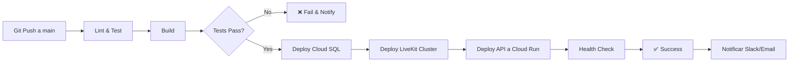

# SECRETOS REQUERIDOS PARA GitHub Actions CI/CD

## 📋 Variables de Entorno / Secrets

Agregar estos secrets en **GitHub Repository → Settings → Secrets and variables → Actions**

### 1. GCP_AUTH (Service Account Key)

**Nombre:** `GCP_SA_KEY`  
**Tipo:** Secret  
**Valor:** Contenido completo del JSON de una Service Account con permisos:

- Cloud SQL Admin
- Compute Admin
- Secret Manager Admin
- Cloud Run Admin
- Service Account User

**Cómo crear:**

```bash
# 1. Crear service account en GCP
gcloud iam service-accounts create github-actions-deployer \
  --display-name="GitHub Actions Deployer"

# 2. Asignar roles
gcloud projects add-iam-policy-binding $PROJECT_ID \
  --member="serviceAccount:github-actions-deployer@$PROJECT_ID.iam.gserviceaccount.com" \
  --role="roles/cloudsql.admin"

gcloud projects add-iam-policy-binding $PROJECT_ID \
  --member="serviceAccount:github-actions-deployer@$PROJECT_ID.iam.gserviceaccount.com" \
  --role="roles/compute.admin"

gcloud projects add-iam-policy-binding $PROJECT_ID \
  --member="serviceAccount:github-actions-deployer@$PROJECT_ID.iam.gserviceaccount.com" \
  --role="roles/run.admin"

gcloud projects add-iam-policy-binding $PROJECT_ID \
  --member="serviceAccount:github-actions-deployer@$PROJECT_ID.iam.gserviceaccount.com" \
  --role="roles/secretmanager.secretAccessor"

# 3. Generar key
gcloud iam service-accounts keys create ~/github-actions-key.json \
  --iam-account=github-actions-deployer@$PROJECT_ID.iam.gserviceaccount.com

# 4. Copiar contenido del JSON
cat ~/github-actions-key.json
```

Pegar todo el JSON en el secret `GCP_SA_KEY`.

---

### 2. GCP_PROJECT_ID

**Nombre:** `GCP_PROJECT_ID`  
**Tipo:** Variable (no secret)  
**Valor:** `connect-ph-123456` (tu project ID de GCP)

---

### 3. DB_PASSWORD

**Nombre:** `DB_PASSWORD`  
**Tipo:** Secret  
**Valor:** Contraseña segura para usuario `connect_ph_user` en Cloud SQL  
**Requisitos:** Mínimo 16 caracteres, aleatoria

**Generar:**

```bash
openssl rand -base64 32
# o
openssl rand -hex 32
```

**IMPORTANTE:** Esta misma password debe ir en:

- `infrastructure/cloudsql/terraform.tfvars` como `db_password`
- GitHub secret `DB_PASSWORD`
- (Opcional) Cloud SQL Secret Manager si prefieres que el deployment la lea de allí

---

### 4. LIVEKIT_API_KEY

**Nombre:** `LIVEKIT_API_KEY`  
**Tipo:** Secret  
**Valor:** API Key de LiveKit (creada en servidor LiveKit o generated via `livekit-server --create-api-key`)

**Cómo obtener:**

```bash
# Si tienes acceso al servidor LiveKit
docker exec livekit-server livekit-server --create-api-key

# O desde tu archivo .env existente
echo $LIVEKIT_API_KEY
```

---

### 5. LIVEKIT_API_SECRET

**Nombre:** `LIVEKIT_API_SECRET`  
**Tipo:** Secret  
**Valor:** API Secret de LiveKit (paired con LIVEKIT_API_KEY)

---

### 6. JWT_SECRET

**Nombre:** `JWT_SECRET`  
**Tipo:** Secret  
**Valor:** Clave secreta para firmar JWT tokens (mínimo 64 caracteres recomendado)

**Generar:**

```bash
openssl rand -base64 64
```

---

### 7. CORS_ORIGINS

**Nombre:** `CORS_ORIGINS`  
**Tipo:** Variable (no secret)  
**Valor:** URLs permitidas para CORS (separadas por comas)  
**Ejemplo:** `https://connect-ph-frontend.vercel.app,https://app.connectph.com`

En desarrollo puedes usar `*` pero en producción especifica dominios exactos.

---

### 8. VPC_ID

**Nombre:** `VPC_ID`  
**Tipo:** Variable (no secret)  
**Valor:** ID de la VPC donde están LiveKit y Cloud SQL  
**Formato:** `projects/PROJECT_ID/global/networks/livekit-vpc`

**Obtener:**

```bash
gcloud compute networks list --format="value(name)"
# Si el nombre es "livekit-vpc":
VPC_ID="projects/$PROJECT_ID/global/networks/livekit-vpc"
```

---

## 🔄 Flujo del Pipeline CI/CD



---

## 📝 Archivos del Pipeline

### `.github/workflows/deploy-gcp.yml` (Creado)

- **Jobs:**
  1. `test` - Lint, unit tests, build
  2. `deploy-cloudsql` - Terraform apply Cloud SQL
  3. `deploy-livekit` - Terraform apply LiveKit cluster
  4. `deploy-api` - Build & deploy a Cloud Run
  5. `notify` - Notificar éxito/fallo

**Dependencias:** Secuencial (cada job espera al anterior)

---

## 🚀 PARA INICIAR DESPLIEGUE AUTOMÁTICO

### Paso 1: Configurar Secrets en GitHub

```bash
# En tu repo de GitHub:
# Settings → Secrets and variables → Actions → New repository secret

Agregar:
1. GCP_SA_KEY (secret) - JSON de service account
2. DB_PASSWORD (secret) - password DB
3. LIVEKIT_API_KEY (secret)
4. LIVEKIT_API_SECRET (secret)
5. JWT_SECRET (secret)

Agregar Variables (no secret):
6. GCP_PROJECT_ID
7. CORS_ORIGINS
8. VPC_ID
```

### Paso 2: Primer Despliegue Manual (opcional)

Si el pipeline falla en infraestructura (Terraform), puedes desplegar manualmente:

```bash
# 1. Clonar repo
git clone <tu-repo>
cd connect_ph_backend

# 2. Configurar terraform.tfvars
cd infrastructure/cloudsql
cp terraform.tfvars.example terraform.tfvars
# Editar con tus valores

# 3. Deploy DB
terraform init
terraform apply

# 4. Deploy LiveKit
cd ../livekit-cluster
terraform init
terraform apply

# 5. Deploy API
cd ../..
gcloud run deploy connect-ph-api --source . --region us-central1
```

### Paso 3: Push a GitHub

```bash
git add .
git commit -m "feat: add CI/CD pipeline for GCP deployment"
git push origin main
```

El pipeline se ejecutará automáticamente.

---

## 🐛 TROUBLESHOOTING

### Error: "GCP_SA_KEY not found"

- Verificar que el secret existe en GitHub
- Verificar que el JSON es válido (no corrupto)

### Error: Terraform plan/apply failed

- Revisar logs del job `deploy-cloudsql` o `deploy-livekit`
- Ejecutar manualmente en local para ver error exacto

### Error: Cloud Run deployment timeout

- Aumentar timeout en workflow (default 1 hora)
- Verificar que build termina en < 10 min

### Error: Health check failed

- Revisar logs de Cloud Run: `gcloud run services logs read`
- Verificar que DB connection string es correcta
- Verificar que VPC peering está configurado

---

## 📊 COSTOS DEL PIPELINE

GitHub Actions es **gratuito** para repositorios públicos. Para privados:

- **Free:** 2,000 minutos/mes
- **$0.08/minuto** adicional

**Tiempo estimado por deploy:**

- Test + Build: ~5 minutos
- Terraform Cloud SQL: ~10 minutos
- Terraform LiveKit: ~8 minutos
- Deploy Cloud Run: ~3 minutos
- **Total:** ~30 minutos por deploy

**Costo si overages:** 30 min × $0.08 = **$0.02 por deploy** (despreciable)

---

## ✅ CHECKLIST FINAL ANTES DE PRIMER DEPLOY

- [ ] Service Account creada en GCP con roles necesarios
- [ ] `GCP_SA_KEY` JSON agregado a GitHub Secrets
- [ ] `GCP_PROJECT_ID` configurado
- [ ] `DB_PASSWORD` generado y agregado
- [ ] `LIVEKIT_API_KEY` y `LIVEKIT_API_SECRET` obtenidos
- [ ] `JWT_SECRET` generado
- [ ] `VPC_ID` configurado (si VPC ya existe)
- [ ] Terraform files en `infrastructure/` sin errores de sintaxis
- [ ] `connecting_ph.sql` probado en DB local
- [ ] `npm run build` funciona localmente
- [ ] `npm run test` pasa (al menos lint)

---

## 🎯 QUÉ HACE FALTA **AHORA MISMO**

1. **Crear la Service Account en GCP** (si no existe)
2. **Subir el JSON key a GitHub secret `GCP_SA_KEY`**
3. **Configurar `VPC_ID`** (red donde estarán los recursos)
4. **Generar y subir `DB_PASSWORD`** (usar openssl)
5. **Tener listas las LiveKit credentials** (API_KEY/SECRET)
6. **Push a GitHub** → Pipeline se dispara automáticamente

---

**Una vez configurados los secrets, cualquier push a `main` desplegará automáticamente:**

1. Cloud SQL (infraestructura pesada)
2. LiveKit Cluster (balanceador + nodos)
3. API en Cloud Run (serverless)

**Todo en ~30 minutos sin intervención manual.**
